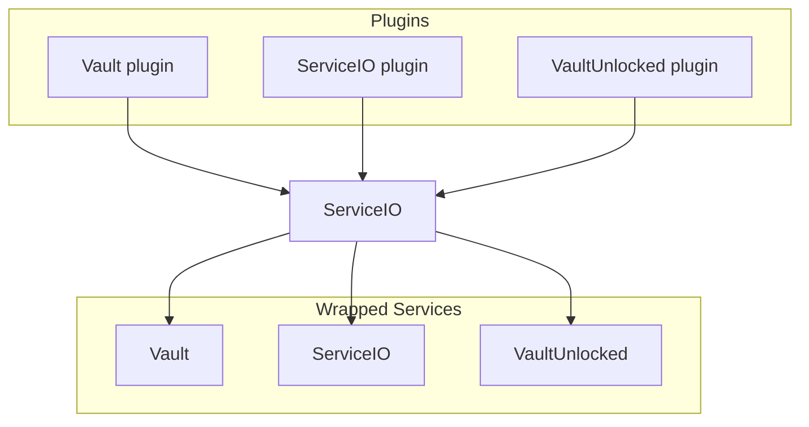

ServiceIO is a powerful, modern replacement for Vault that provides a comprehensive service layer for Minecraft servers.
It offers the traditional Vault API and the VaultUnlocked API while extending functionality far beyond what Vault provides.

**100% Vault and VaultUnlocked compatibility**, just remove the Vault plugin and drop in ServiceIO.

## What is ServiceIO?

ServiceIO is designed as a drop-in replacement for Vault, but with significantly more features and a cleaner, more modern API.
While Vault focuses primarily on economy services, ServiceIO provides unified interfaces for:

- **Economy Services** - Balance management, transactions, and banking  
- **Permission Services** - Groups and permissions  
- **NPC Services** - NPC management  
- **Hologram Services** - Unified hologram API  
- **Chat Services** - Chat formatting and prefixes/suffixes  
- **Service Conversion** - Convert data between different service providers

## Key Features

### Service Provider Flexibility

ServiceIO allows you to switch between different service providers (like economy or permission plugins) without losing your data.
The built-in conversion system lets you migrate from one plugin to another seamlessly.
While Vault offers the same functionality for economy services, ServiceIO makes it possible for all services.
This allows you to switch from, lets say, GroupManager to LuckPerms in a breeze, or from Citizens to FancyNPCs.

### Full Compatibility
- **Vault API** - Complete drop-in replacement
- **VaultUnlocked API** - Modern async-capable alternative
- **Paper & Folia** - Optimized for modern server software
- **PlaceholderAPI** - Extensive placeholder support

## Supported Services

### Economy
- Balance management (per-world support)
- Banking systems
- Currency formatting
- Multi-language support
- Support for multiple currencies

### Permissions
- Group management
- Permission assignment
- Prefix/suffix handling
- Inheritance systems
- World-specific permissions

### NPC Management
- Unified NPC API
- Event handling

### Holograms
- Unified Hologram API
- Dynamic content updates

## How does ServiceIO Work?

ServiceIO uses a wrapper-based architecture that creates a bridge between different service APIs:

This design allows:
- **Multi-directional Compatibility** - Vault plugins work with modern services and vice versa
- **Service Abstraction** - Switch providers without changing your plugins
- **Enhanced Features** - Access advanced features through the ServiceIO API

## Why Choose ServiceIO?

### For Server Administrators
- **Easy Migration** - Convert between different plugins effortlessly
- **Better Performance** - Optimized for modern server software
- **Comprehensive Support** - Handles economy, permissions, NPCs, and more

### For Developers
- **Clean APIs** - Modern, well-documented interfaces
- **Future-Proof** - Built for current and upcoming Minecraft versions
- **Type Safety** - Better IDE support and fewer runtime errors

### For Players
- **Seamless Experience** - All your favorite plugins work together
- **Data Preservation** - Never lose progress during plugin changes
- **Better Performance** - Faster responses and reduced lag